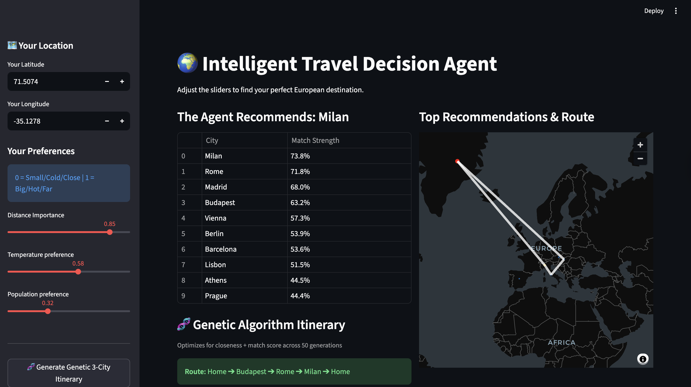
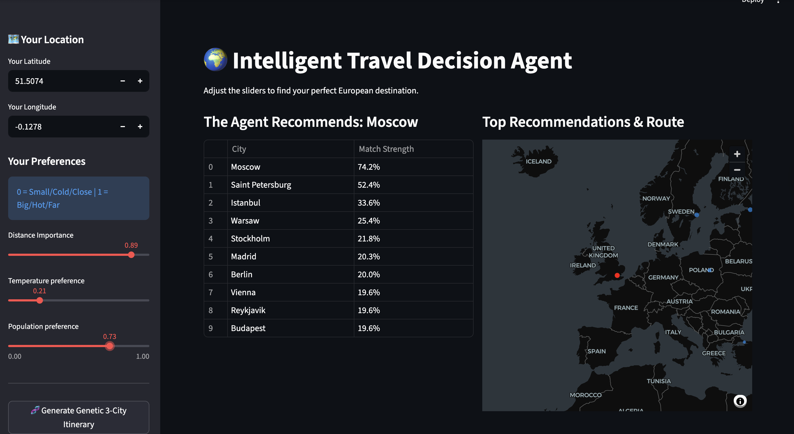

# Intelligent Travel Decision Agent

**Author:** Teague Schnittger  
**Course:** Intro to Artificial Intelligence — IFSA Study Abroad Program  
**Python Version:** 3.13.5

---



## Overview

A Streamlit web application that acts as an intelligent travel agent, recommending European cities based on user-defined preferences for distance, temperature, and population. The system combines a rule-based utility scoring agent with a Genetic Algorithm to produce both a top-city recommendation and an optimized 3-city itinerary.

---

## AI Techniques Used

### Rule-Based Utility Agent
The `TravelAgent` scores each city using a multiplicative utility function:

```
score = (1 - |dist_norm - w_dist|) × (1 - |temp_norm - w_temp|) × (1 - |pop_norm - w_pop|)
```

Where `w_*` are user preference weights on a 0–1 scale and `*_norm` are min-max normalized city attributes. The multiplicative combination penalizes cities that miss on any single dimension [1].

### Genetic Algorithm Planner
The `GeneticPlanner` evolves a population of 3-city routes over 50 generations using selection, elitism, and crossover. Fitness balances total city match score against round-trip travel distance, favoring geographically compact, high-scoring itineraries [2].

---

## Dependencies

| Package    | Version |
|------------|---------|
| streamlit  | 1.55.0  |
| pandas     | 2.3.3   |
| pydeck     | 0.9.1   |
| geopy      | 2.4.1   |

Install all dependencies:

```bash
pip install streamlit==1.55.0 pandas==2.3.3 pydeck==0.9.1 geopy==2.4.1
```

---

## Running the App

```bash
streamlit run main.py
```

> **Note:** Do not run with `python3 main.py` — Streamlit requires its own server to function correctly.

---

## Project Structure

```
AI_Project/
├── main.py              # Streamlit UI and orchestration
├── data/
│   └── cities.json      # Static dataset of ~25 European cities
└── src/
    ├── agent.py         # TravelAgent — utility scoring logic
    ├── planner.py       # GeneticPlanner — 3-city itinerary optimization
    └── utils.py         # Distance calculation and min-max normalization
```

---

## How to Use

1. Enter your current **latitude and longitude** in the sidebar.
2. Adjust the three preference sliders:
   - **Distance Importance** — 0 = prefer nearby cities, 1 = prefer farther cities
   - **Temperature Preference** — 0 = prefer cold climates, 1 = prefer hot climates
   - **Population Preference** — 0 = prefer small cities, 1 = prefer large cities
3. The agent instantly ranks all cities by match strength (see *Figure 1*).
4. Click **Generate Genetic 3-City Itinerary** to run the Genetic Algorithm and get an optimized route with minimal travel between stops (see *Figure 2*).

---

## Figures

**Figure 1.** Ranked recommendations table and interactive map showing top 5 cities. The gold dot marks the top recommended city; blue dots mark remaining top matches; red dot marks the user's location. Map rendered using PyDeck / deck.gl [2].



**Figure 2.** Genetic Algorithm itinerary result showing the optimized 3-city route. White lines on the map trace the full round-trip path from home through each city and back.


---

## AI Tools Declared

| Tool | Version | Purpose |
|------|---------|---------|
| Claude Code (Anthropic) | claude-sonnet-4-6 | AI coding assistant — used for code generation, debugging, docstrings, and README authoring |

---

## References

[1] Streamlit Inc. (2024). *Streamlit Documentation*. https://docs.streamlit.io

[2] Uber Technologies. (2024). *deck.gl — WebGL2 Powered Geospatial Visualization Layers*. https://deck.gl

[3] Kostya Lopuhin et al. (2024). *GeoPy Documentation — Geocoding library for Python*. https://geopy.readthedocs.io/en/stable/

[4] pandas Development Team. (2024). *pandas: Powerful Python Data Analysis Toolkit*. https://pandas.pydata.org/docs/
